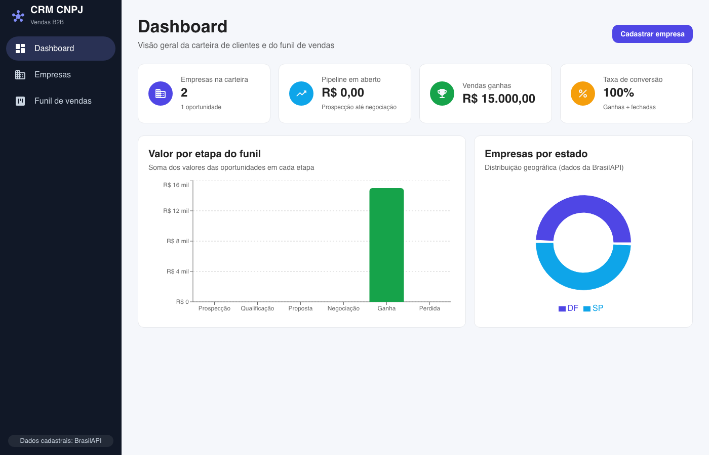
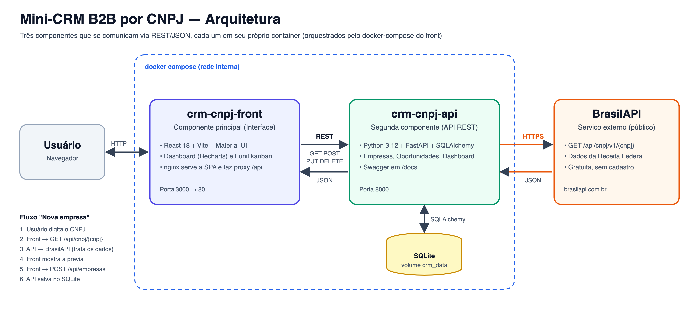
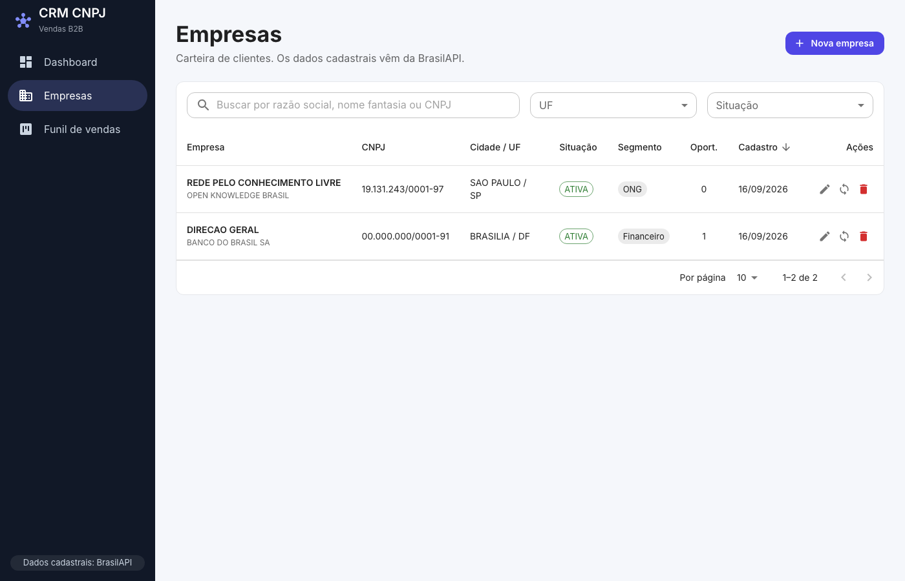
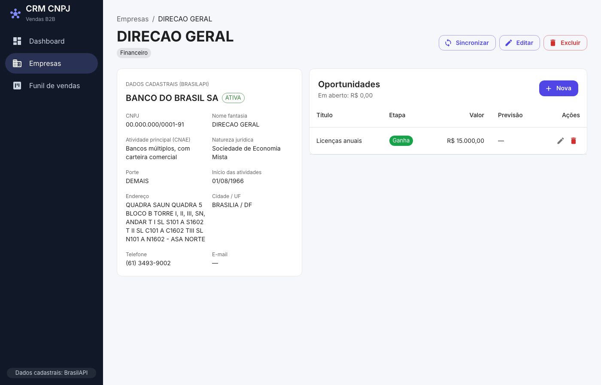
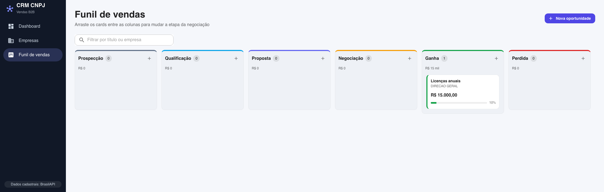

# CRM CNPJ

Interface do **Mini-CRM B2B por CNPJ**, a componente principal do MVP. Uma equipe de vendas cadastra empresas clientes informando **apenas o CNPJ**: os dados cadastrais (razão social, endereço, atividade, situação na Receita) são preenchidos automaticamente pela [BrasilAPI](https://brasilapi.com.br). Em seguida, a equipe acompanha as **oportunidades de venda** de cada empresa em um funil kanban e vê os resultados em um dashboard.

> API (componente secundária): https://github.com/ph-souzaa/crm-cnpj-api



## Sumário

- [Funcionalidades](#funcionalidades)
- [Arquitetura](#arquitetura)
- [Tecnologias](#tecnologias)
- [Como executar](#como-executar)
- [Serviço externo: BrasilAPI](#serviço-externo-brasilapi)
- [Telas](#telas)
- [Testes](#testes)
- [Estrutura de pastas](#estrutura-de-pastas)
- [Roteiro do vídeo](#roteiro-do-vídeo)

## Funcionalidades

| Tela | Rota | O que faz |
|---|---|---|
| Dashboard | `/` | Indicadores (empresas, pipeline em aberto, vendas ganhas, taxa de conversão), gráfico de valor por etapa do funil e gráfico de empresas por estado |
| Empresas | `/empresas` | Tabela paginada com busca, filtros por UF e situação cadastral e ordenação. Cadastro por CNPJ com **prévia dos dados da BrasilAPI** antes de salvar, edição, sincronização com a BrasilAPI e exclusão com confirmação |
| Detalhe da empresa | `/empresas/:id` | Dados cadastrais completos e oportunidades da empresa (criar, editar, excluir) |
| Funil de vendas | `/funil` | Kanban com **arrastar e soltar** para mudar a etapa da negociação, filtro e criação de oportunidades |

A interface também mostra notificações de sucesso e erro, indicadores de carregamento e mensagens para listas vazias. O CNPJ é validado (dígitos verificadores) já no navegador.

## Arquitetura



- O navegador acessa a **Interface** (React), servida pelo **nginx** na porta 3000.
- Toda chamada para `/api/*` é repassada pelo nginx para a **API** (`crm-cnpj-api`, porta 8000). Assim, o front não precisa saber o endereço da API e não há problemas de CORS.
- A **API** é a única que acessa o banco **SQLite** e a **BrasilAPI**.
- No desenvolvimento local, o proxy do Vite faz o mesmo papel do nginx.

## Tecnologias

- React 18 + Vite
- Material UI (MUI) 6
- React Router 6
- Recharts (gráficos)
- @hello-pangea/dnd (arrastar e soltar do kanban)
- Vitest (testes)
- nginx (servidor e proxy no container)

## Como executar

### Opção 1: Docker Compose (recomendado)

Sobe a **Interface e a API** juntas. Pré-requisitos: [Docker](https://docs.docker.com/get-docker/) e [Git](https://git-scm.com/).

Clone os dois repositórios **lado a lado**, na mesma pasta:

```bash
git clone https://github.com/ph-souzaa/crm-cnpj-api.git
git clone https://github.com/ph-souzaa/crm-cnpj-front.git
cd crm-cnpj-front
docker compose up --build -d
```

Se preferir não clonar a API, o Compose pode buildá-la direto do GitHub:

```bash
API_CONTEXT=https://github.com/ph-souzaa/crm-cnpj-api.git docker compose up --build -d
```

Depois de subir:

- Interface: http://localhost:3000
- Swagger da API: http://localhost:8000/docs

Para parar: `docker compose down` (os dados continuam salvos no volume `crm_data`). Para apagar também os dados: `docker compose down -v`.

### Opção 2: Ambiente local

Pré-requisito: Node.js 20 ou superior. A API precisa estar rodando em http://localhost:8000 (veja o README do [crm-cnpj-api](https://github.com/ph-souzaa/crm-cnpj-api)).

```bash
npm install
npm run dev
```

A interface sobe em http://localhost:5173 e o Vite repassa as chamadas `/api/*` para a API.

### Opção 3: Somente o container da interface

```bash
docker build -t crm-cnpj-front .
docker run -d -p 3000:80 -e API_URL=http://<endereço-da-api>:8000 crm-cnpj-front
```

| Variável | Padrão | Descrição |
|---|---|---|
| `API_URL` | `http://api:8000` | Endereço da API para onde o nginx repassa as chamadas `/api/*` |

## Serviço externo: BrasilAPI

A interface não chama a BrasilAPI diretamente: ela usa a API do projeto, que consulta a BrasilAPI e trata os dados.

| Item | Informação |
|---|---|
| Site | https://brasilapi.com.br |
| Documentação | https://brasilapi.com.br/docs#tag/CNPJ |
| Rota utilizada | `GET https://brasilapi.com.br/api/cnpj/v1/{cnpj}` |
| Dados usados | Razão social, nome fantasia, situação cadastral, CNAE, natureza jurídica, porte, início das atividades, endereço, telefone e e-mail |
| Licença | MIT (projeto open source: https://github.com/BrasilAPI/BrasilAPI) |
| Cadastro / chave | Não é necessário; a API é pública e gratuita |
| Observações | Tem limite de requisições. A API do projeto guarda as consultas em cache por 10 minutos e mostra uma mensagem amigável quando o limite é atingido |

## Telas

**Empresas**



**Detalhe da empresa**



**Funil de vendas**



## Testes

```bash
npm test
```

Os testes cobrem a validação e formatação de CNPJ e a formatação de valores.

## Estrutura de pastas

```
crm-cnpj-front/
├── src/
│   ├── main.jsx / App.jsx   # entrada da aplicação e rotas
│   ├── theme.js             # tema do Material UI
│   ├── pages/               # Dashboard, Empresas, Detalhe da empresa, Funil
│   ├── components/
│   │   ├── layout/          # menu lateral e estrutura da página
│   │   ├── common/          # componentes reutilizáveis (KPI, diálogo de confirmação...)
│   │   ├── empresas/        # tabela, cadastro, edição e resumo de empresa
│   │   └── oportunidades/   # kanban, card e formulário de oportunidade
│   ├── services/            # chamadas HTTP para a API
│   ├── contexts/            # notificações (snackbar)
│   ├── hooks/               # debounce e ações de oportunidade
│   ├── constants/           # etapas do funil, UFs e situações
│   └── utils/               # CNPJ e formatação (com testes)
├── docs/                    # fluxograma da arquitetura e capturas de tela
├── nginx.conf               # servidor da SPA + proxy /api
├── Dockerfile               # build (Node) + nginx
└── docker-compose.yml       # Interface + API
```

## Roteiro do vídeo

Vídeo de até 3 minutos:

1. **Arquitetura (0:00–0:30):** mostrar o fluxograma e explicar os três componentes (Interface, API e BrasilAPI) e o proxy do nginx.
2. **Subindo o projeto (0:30–0:50):** `docker compose up --build -d` e os dois containers em execução.
3. **Cadastro por CNPJ (0:50–1:30):** em Empresas, digitar um CNPJ, mostrar a prévia vinda da BrasilAPI e salvar. Mostrar a validação de CNPJ inválido e o aviso de empresa já cadastrada.
4. **Lista e detalhe (1:30–2:00):** busca, filtros, ordenação e paginação; abrir o detalhe, editar e sincronizar com a BrasilAPI.
5. **Funil (2:00–2:35):** criar uma oportunidade e arrastá-la entre as etapas até "Ganha".
6. **Dashboard e API (2:35–3:00):** indicadores e gráficos atualizados; Swagger da API em `/docs`.
